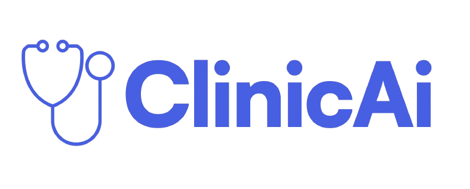

# 🩺 ClínicAI - Asistente de IA para Notas Clínicas

<div align="center">



**Plataforma avanzada de inteligencia artificial para la generación, análisis y gestión de notas clínicas**

[](https://nextjs.org/)
[](https://www.typescriptlang.org/)
[](https://openai.com/)
[](https://supabase.com/)
[](https://tailwindcss.com/)

</div>

## 📋 Descripción

ClínicAI es una aplicación web avanzada que utiliza inteligencia artificial para asistir a profesionales de la salud en la creación, análisis y gestión de notas clínicas. La plataforma integra tecnologías de vanguardia como GPT-4 de OpenAI para generar contenido médico preciso, consultas basadas en evidencia científica y escalas clínicas automatizadas.

### 🎯 Características Principales

- **🤖 Generación Inteligente de Notas**: Creación automática de notas clínicas usando plantillas personalizables
- **📊 Escalas Clínicas con IA**: Cálculo automático de escalas médicas (Glasgow, NIHSS, RASS, Braden, etc.)
- **🔬 Consultas Basadas en Evidencia**: Generación de recomendaciones médicas respaldadas por evidencia científica
- **✏️ Editor Avanzado de Notas**: Editor completo con funciones de actualización y modificación
- **📚 Sistema de Plantillas**: Creación y gestión de plantillas médicas personalizadas
- **🗃️ Historial Inteligente**: Almacenamiento y búsqueda de notas clínicas previas
- **🎤 Reconocimiento de Voz**: Dictado por voz para entrada de datos más eficiente
- **🌓 Modo Oscuro/Claro**: Interfaz adaptable para diferentes condiciones de trabajo
- **🎓 Tutorial Integrado**: Guía interactiva para nuevos usuarios
- **🔐 Autenticación Segura**: Sistema de login seguro con Supabase
- **📱 Diseño Responsivo**: Optimizada para dispositivos móviles y de escritorio

## 🚀 Tecnologías Utilizadas

### Frontend
- **[Next.js 14](https://nextjs.org/)** - Framework de React con SSR/SSG
- **[TypeScript](https://www.typescriptlang.org/)** - Superset de JavaScript tipado
- **[React 18](https://reactjs.org/)** - Biblioteca de UI
- **[Tailwind CSS](https://tailwindcss.com/)** - Framework de CSS utility-first
- **[Framer Motion](https://www.framer.com/motion/)** - Biblioteca de animaciones
- **[Radix UI](https://www.radix-ui.com/)** - Componentes de UI accesibles

### Backend y Servicios
- **[OpenAI GPT-4](https://openai.com/)** - Inteligencia artificial para generación de contenido
- **[Supabase](https://supabase.com/)** - Base de datos PostgreSQL y autenticación
- **[Next.js API Routes](https://nextjs.org/docs/api-routes/introduction)** - API serverless

### Herramientas de Desarrollo
- **[ESLint](https://eslint.org/)** - Linter de código
- **[Prettier](https://prettier.io/)** - Formateador de código
- **[PostCSS](https://postcss.org/)** - Procesador de CSS

### Librerías Adicionales
- **[Lucide React](https://lucide.dev/)** - Iconos SVG
- **[Class Variance Authority](https://cva.style/)** - Utilidad para clases CSS
- **[Zod](https://zod.dev/)** - Validación de esquemas TypeScript
- **[React Icons](https://react-icons.github.io/react-icons/)** - Biblioteca de iconos
- **[Sonner](https://sonner.emilkowal.ski/)** - Notificaciones toast

## 📦 Instalación

### Requisitos Previos

- **Node.js** >= 18.17.0
- **npm** >= 8.0.0
- **Cuenta de OpenAI** con API key
- **Proyecto de Supabase** configurado

### 1. Clonar el Repositorio

```bash
git clone https://github.com/tu-usuario/clinicai.git
cd clinicai
```

### 2. Instalar Dependencias

```bash
npm install
```

### 3. Configurar Variables de Entorno

Crea un archivo `.env.local` en la raíz del proyecto:

```env
# OpenAI
NEXT_PUBLIC_OPENAI_API_KEY=tu-api-key-de-openai

# Supabase
NEXT_PUBLIC_SUPABASE_URL=tu-url-de-supabase
NEXT_PUBLIC_SUPABASE_ANON_KEY=tu-clave-publica-de-supabase
```

### 4. Configurar Supabase

Ejecuta las migraciones de base de datos:

```bash
# Asegúrate de tener Supabase CLI instalado
npx supabase db push
```

### 5. Ejecutar en Modo Desarrollo

```bash
npm run dev
```

La aplicación estará disponible en `http://localhost:3000`

## 🔧 Scripts Disponibles

```bash
# Desarrollo
npm run dev              # Inicia el servidor de desarrollo
npm run dev:clean        # Limpia caché y inicia desarrollo

# Construcción
npm run build            # Construye la aplicación para producción
npm run build:production # Construye con optimizaciones de producción
npm run start            # Inicia el servidor de producción
npm run preview          # Construye y previsualiza localmente

# Calidad de Código
npm run lint             # Ejecuta ESLint
npm run lint:fix         # Corrige errores de ESLint automáticamente
npm run format           # Formatea código con Prettier
npm run format:check     # Verifica formato sin cambios
npm run type-check       # Verifica tipos de TypeScript

# Utilidades
npm run analyze          # Analiza el bundle de la aplicación
npm run clean            # Limpia archivos temporales
npm run health-check     # Verifica el estado de la aplicación
```

## 🏗️ Arquitectura del Proyecto

```
src/
├── app/                    # App Router de Next.js 14
│   ├── api/               # API Routes
│   ├── auth/              # Páginas de autenticación
│   ├── legal/             # Páginas legales
│   └── layout.tsx         # Layout principal
├── components/            # Componentes React
│   ├── auth/              # Componentes de autenticación
│   ├── notes/             # Componentes de notas médicas
│   ├── ui/                # Componentes de UI reutilizables
│   └── views/             # Vistas principales
├── contexts/              # Contextos de React
├── hooks/                 # Hooks personalizados
├── lib/                   # Utilidades y servicios
│   ├── schemas/           # Esquemas de validación
│   ├── services/          # Servicios de API
│   └── utils/             # Funciones utilitarias
└── types/                 # Definiciones de tipos TypeScript
```

## 📚 Uso de la Aplicación

### 1. Inicio de Sesión
- Accede a la aplicación y inicia sesión con tu cuenta
- Si es tu primera vez, puedes seguir el tutorial integrado

### 2. Creación de Plantillas
- Ve a la sección "Plantillas"
- Crea plantillas personalizadas para diferentes tipos de notas
- Define estructura y campos específicos para cada especialidad

### 3. Generación de Notas
- Selecciona una plantilla
- Ingresa la información del paciente (texto o voz)
- La IA generará una nota estructurada automáticamente

### 4. Escalas Clínicas
- Utiliza las escalas predefinidas (Glasgow, NIHSS, etc.)
- Ingresa los datos del paciente
- Obtén cálculos automáticos y interpretaciones

### 5. Consultas de Evidencia
- Realiza consultas sobre temas médicos específicos
- Recibe recomendaciones basadas en evidencia científica
- Guarda las consultas en tu historial

## 🔐 Seguridad y Privacidad

- **Autenticación Segura**: Sistema de autenticación robusto con Supabase
- **Encriptación**: Todos los datos sensibles están encriptados
- **HIPAA Compliance**: Diseñado considerando estándares de privacidad médica
- **API Keys**: Gestión segura de claves de API
- **Validación**: Validación exhaustiva de datos de entrada

## 🤝 Contribución

Las contribuciones son bienvenidas. Para contribuir:

1. Fork el proyecto
2. Crea una rama para tu feature (`git checkout -b feature/AmazingFeature`)
3. Commit tus cambios (`git commit -m 'Add some AmazingFeature'`)
4. Push a la rama (`git push origin feature/AmazingFeature`)
5. Abre un Pull Request

## 📄 Licencia

Este proyecto está bajo la Licencia MIT. Ver el archivo `LICENSE` para más detalles.

## 👨‍💻 Autor

**Nicolás Ceballos Brito**
- 🌐 Portfolio: [https://nico2603.github.io/PersonalPage/](https://nico2603.github.io/PersonalPage/)
- 💼 LinkedIn: [https://www.linkedin.com/in/nicolas-ceballos-brito/](https://www.linkedin.com/in/nicolas-ceballos-brito/)
- 🐙 GitHub: [https://github.com/Nico2603](https://github.com/Nico2603)

## 🏢 Empresa

Desarrollado para **[Teilur.ai](https://teilur.ai)** - Conectando talento latinoamericano con empresas estadounidenses a través de la innovación tecnológica.

## 🚧 Roadmap

- [ ] Integración con sistemas de Historia Clínica Electrónica (HCE)
- [ ] Análisis de imágenes médicas con IA
- [ ] Reportes y analytics avanzados
- [ ] API pública para integraciones
- [ ] Aplicación móvil nativa
- [ ] Soporte multiidioma
- [ ] Integración con dispositivos médicos IoT

## 📞 Soporte

Si tienes preguntas, problemas o sugerencias:

1. Revisa la documentación en este README
2. Busca en los [Issues](../../issues) existentes
3. Crea un nuevo [Issue](../../issues/new) si es necesario
4. Contacta al desarrollador a través de LinkedIn

---

<div align="center">

**¡Gracias por usar ClínicAI! 🩺🤖**

*Revolucionando la documentación clínica con inteligencia artificial*

</div> 